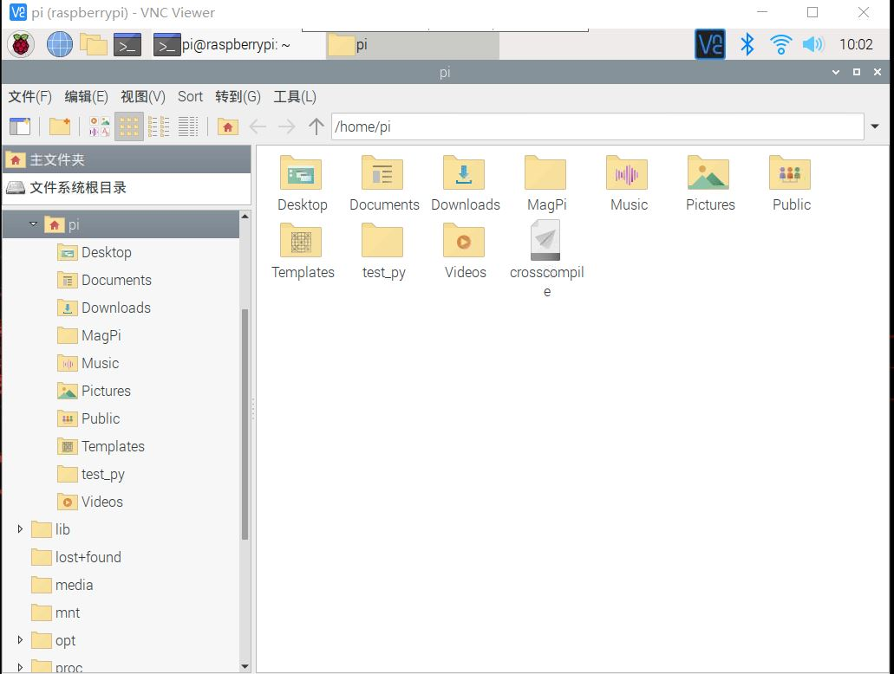

# 构建主机端开发环境（下）

#### 第六组

#### 雷玉泉  刘晟荣  徐鹏涛


## 一、实验目的
 学会下载安装Linux及相关工具到目标机或目标机仿真环境。 

 学会使用交叉编译器编译应用程序，并能够将可执行程序下载到目标机运行。 

 学会使用交叉调试工具gdb-gdbserver调试应用程序。 


## 二、实验内容

 Host-Target 方案1：下载安装Linux系统到开发板， 其中包括bootloader、内核、模块、库、文件系 统等；建立host-target连接 ，常见连接有SSH， VNC，Putty。 

 Host-Target 方案2：下载安装目标机仿真环境 qemu，安装qemu树莓派系统。 

 构建并测试开发板交叉编译器。 

 建立gdb-gdbserver交叉调试环境并能够调试应用程序

## 三、实验过程与结果

### 1、Host-Target

####目标板最终实现vnc的连接


####qemu树莓派系统


### 2、构建并测试开发板交叉编译器 
安装交叉编译工具：
```
$sudo apt-get install git  
$mkdir raspberrypi   
cd raspberrypi 
git clone git://github.com/raspberrypi/tools.git 
cd ~/raspberrypi/tools/arm-bcm2708/ 
```
打开.bashrc 文件（$ vim ~/.bashrc），在文件结尾加入：
```
export PATH=$PATH:$HOME/raspberrypi/tools/arm-bcm2708/gcc-linaro-arm-linux-gnueabihf-raspbian-x64/bin 
```
刷新一下环境变量:
```
source ~/.bashrc
```
测试是否安装成功——在终端键入:
```
arm-linux-gnueabihf-gcc -v 
```
新建 mian.c 文件如下:


进行交叉编译，编译 mian.c，可以看到多了 main.o可执行文件。 
```
arm-linux-gnueabihf-gcc main.c -o main -lm 
```
操作结果如下：


然后使用scp指令将生成的可执行文件copy到树莓派中：




登录树莓派，可以看到正常运行：


### 3、建立gdb-gdbserver交叉调试环境并能够调试应用程序

（1）下载：远程树莓派桌面，浏览器访问http://ftp.gnu.org/gnu/gdb/ ，下载下http://ftp.gnu.org/gnu/gdb/gdb-8.2.tar.gz 版本，将下载的压缩包（位于/home/pi/Downloads）复制到到/home/pi 目录下，cd 至此目录， 解压安装包 tar xvzf gdb-8.2.tar.gz 。

（2）配置 gdb ：

配置环境：$./configure --target=arm-linux --prefix=/usr/local/arm-gdb -v 


编译$make


执行$sudo make install(先执行 sudo apt-get install texinfo),如果配置成功：（生成 arm-linux-gdb,并存入/usr/local/arm-gdb /bin/，查询确认下） 


将生成的 arm-linux-gdb 文件拷贝到系统/usr/bin/目录下，这样便可以在任何地方很方便的调用。  
```
cd /usr/local/arm-gdb/bin 
ls 
sudo cp arm-linux-gdb /usr/bin/ 
```


进入/home/pi/gdb-8.2/gdb/gdbserver 文件夹： 
```
cd /home/pi/gdb-8.2/gdb/gdbserver 
export PATH=$PATH:/usr/local/arm-gdb/bin 
./configure --target=arm-linux --host=arm-linux 
make CC=arm-linux-gnueabihf-gcc
```

这一步完成之后，在 gdbserver 的目录下生成gdbserver的可执行文件. 

接下来进行gbdserver调试，首先在Host端生成带有调试信息的main_g文件：


将其用scp上传树莓派，然后在树莓派端执行./gdbserver :1234 main_g:


在host端执行arm-linux-gnueabihf-gdb main_g(进入 gdb 后，进行远程调试。(gdb)target remote 192.168.137.188:1234  其中192.168.137.188是树莓派 ip，1234 是树莓派开的端口):


可以看到，树莓派的终端显示在debugging了 ：


接下来进行gdb调试：

Host端：


树莓派端：


可以看到这个交叉调试是有效的。 

## 四、实验总结

经过本次实验，我们学会了下载安装Linux及相关工具到目标机或目标机仿真环境；学会了使用交叉编译器编译应用程序；掌握了交叉调试工具gdb-gdbserver调试应用程序。 


