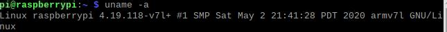

# 构建目标系统

#### 第六组

#### 雷玉泉  刘晟荣  徐鹏涛


## 一、实验目的

 掌握裁剪Linux内核的方法，理解内核选项的意义； 

 熟悉编译内核并加载内核到目标系统的方法与过程； 

 了解模块与内核的关系，掌握内核模块配置编译、安装与卸载流程，为进一步编程，如驱动编程打下基础； 

 掌握创建、安装(卸载)并使用文件系统的方法


## 二、实验内容

 首先用默认配置重新编译一遍已安装到开发板的内核，将新的内核替换现有内核，检查是否通过

 在原始版本基础上，重新配置Linux内核，构建一个嵌入式的Linux内核

 编译安装重新配置后的内核、模块及dtbs设备树 

 针对默认配置中不少于10个kernel feature进行重新配置（裁剪为主、偶有增加），并解释理由：(Y=>N，N=>Y)

 保留必要的模块安装，剩余(占多数)取消；(M=>N)

 make后将新的内核安装到开发板运行测试； 

 选择至少二个模块加载与卸载，检查是否加载、卸载成功； 

 构建并安装至少一款不同于根文件系统、用于应用开发的其它文件系统。 

## 三、实验过程与结果

### 1、重新编译内核，用新内核替换现有内核

在主机端上安装必要的工具:
```
sudo apt install git bc bison flex libssl-dev make
```
首先，在主机端从github上下载最新内核源码：
```
cd raspberrypi
git clone --depth=1 git://github.com/raspberrypi/linux.git
```
同时，检查目标端原始内核版本:
```
uname -a
```

接下来，在主机端内核代码目录运行以下命令来配置内核：
```
cd linux
KERNEL=kernel7l
make ARCH=arm CROSS_COMPILE=arm-linux-gnueabihf- bcm2711_defconfig
```

然后在内核代码目录运行以下命令进行编译：
```
make ARCH=arm CROSS_COMPILE=arm-linux-gnueabihf- zImage modules dtbs
```
将SD卡插入主机端，然后用lsblk查看SD卡分区情况：


接下来挂载SD卡，执行如下指令:  
```
cd raspberrypi
cd linux
mkdir mnt
mkdir mnt/fat32
mkdir mnt/ext4
sudo mount /dev/sdb1 mnt/fat32 （mnt/fat32指向/dev/sdb1）
sudo mount /dev/sdb2 mnt/ext4  （mnt/ext4指向/dev/sdb2）
```  
即创建fat32和ext4目录，并将fat32挂载到sdb1中，将ext4挂载到sdb2中 

安装modules:
```
sudo make ARCH=arm CROSS_COMPILE=arm-linux-gnueabihf- INSTALL_MOD_PATH=mnt/ext4 modules_install
```
然后将内核和设备数拷贝到SD卡上，执行如下指令：  
```
sudo cp mnt/fat32/KERNELL7L.img mnt/fat32/KERNEL7L-backup.img  （备份旧内核for pi4）
sudo cp arch/arm/boot/zImage mnt/fat32/KERNEL7L.img （新内核拷贝至启动分区）
sudo cp arch/arm/boot/dts/*.dtb mnt/fat32/       （拷贝设备树）
sudo cp arch/arm/boot/dts/overlays/*.dtb* mnt/fat32/overlays/
sudo cp arch/arm/boot/dts/overlays/README mnt/fat32/overlays/
sudo umount mnt/fat32    （解除挂载）
sudo umount mnt/ext4
```  
SD卡放回树莓派，上电运行，查看内核版本：



发现版本已改变，说明实验成功。

### 2、内核裁剪并配置编译 
```
sudo apt-get install libncurses5-dev
```
此前内核进过编译，对之前编译的内核进行清理
```
make ARCH=arm CROSS_COMPILE=arm-linux- distclean
```
进入menuconfig进行配置  
```
cd linux
KERNEL=kernel7l
make ARCH=arm CROSS_COMPILE=arm-linux-gnueabihf- bcm2711_defconfig
make ARCH=arm CROSS_COMPILE=arm-linux-gnueabihf- menuconfig
```  


在menuconfig中对内核配置中的选项进行裁剪(点空格，进行选择)。

裁剪(Y-->N)、增加(N-->Y)、多数安装模块取消(M-->N)
```
Networking support ---> Bluetooth subsystem support(M-->N)

用不到蓝牙

Networking support ---> NFC subsystem support(M-->N)

NFC协议用不到

Networking support ---> Amateur Radio support(Y-->N)

电台支持用不到

Networking support ---> CAN bus subsystem support(M-->N)

CAN不需要

Device Drivers ---> Character devices ---> Support for console on virtual terminal(Y-->N)

取消树莓派的开机提示打印信息

Device Drivers ---> Memory Technology Device (MTD) support(M-->N)

MTD子系统是一个闪存转换层.其主要目的是提供一个介于闪存硬件驱动程序与高级应用程序之间的抽象层,以简化闪存设备的驱动.注意:MTD常用于嵌入式系统,而我们常见的U盘/MMC卡/SD卡/CF卡等移动存储设备以及固态硬盘(SSD),虽然也叫"flash",但它们并不是使用MTD技术的存储器.仅在你需要使用主设备号为31的MTD块设备(/dev/romX,/dev/rromX,/dev/flashX,/dev/rflashX),或者主设备号为90的MTD字符设备(/dev/mtdX,/dev/mtdrX)时选"Y",否则选"N".
                                                                              
General setup-->Support initial ramdisks compressed using LZMA (Y-->N)
                                                                                
General setup-->Support initial ramdisks compressed using XZ (Y-->N)
                                                                                 
General setup-->Support initial ramdisks compressed using LZO(Y-->N)
                                                                                
General setup-->Support initial ramdisks compressed using LZ4(Y-->N)
 
对支持的压缩包格式进行裁剪   

Device drivers---> Input device support  ---> Touchscreens(Y-->N)     

触摸屏剪裁

Device drivers---> Input device support  ---> joystick interface(M-->N)   

游戏杆

Files systems--> EXT4 debugging support(N-->Y)

文件系统调试

Devices Drivers-->Character devices-->Serial drivers-->8250/16550(Y-->N)

老式串口兼容不需要

General setup--->Namespaces support(Y-->N)

命名空间，暂时不需要命名空间的支持

Networking support-->Networking options-->IP:TCP syncookie support

抵抗syn flood攻击，不考虑安全项目
```
然后跟1的操作基本一样，进行编译安装。

最后树莓派上测试，发现成功。

### 3.模块卸载与加载  
- 查看系统模块状态  
```
    lsmod
```  

- 卸载一个模块  
这里卸载的是i2c_dev这个模块  
```
sudo rmmod i2c_dev
```


可以看到卸载成功  
- 加载一个模块  
加载的是 gpio-arizona这个模块 
```
sudo insmod gpio-arizona.ko
```  
lsmod发现加载成功。

### 4.创建文件系统 

使用sudo fdisk –l命令查看当前的文件系统的使用情况:


可以看到有两个分区(dev/mmcblk0p1、2)——boot分区，FAT32格式，256M；rootfs分区，EXT4格式，29.5G。

然后使用fdisk增加分区：
```
sudo fdisk /dev/mmcblk0
```
打印提示： Welcome to fdisk (util-linux 2.29.2). Changes will remain in memory only, until you decide to write them. Be careful before using the write command.

查看帮助：输入m查看help

新建分区：输入n add a new partition

新建拓展分区：要建立一个新的逻辑分区，需要先建立一个扩展分区，输入e,建立拓展分区，选择默认值，扩展分区出来的是3MB


第二步根据需要创建逻辑分区

新建分区：输入n add a new partition

新建逻辑分区：输入l,建立逻辑分区

w保存退出

重启系统使修改过的分区信息生效

第三步分区格式化需要的fs，格式化是针对主分区和逻辑分区的。
```
sudo mkfs.ext2 /dev/mmcblk0p5
```

第四步将分区mount到某挂载点
```
sudo mount /dev/mmcblk0p5 /mnt/ext2fs/
```


## 四、实验总结

经过本次实验，我们基本掌握了裁剪Linux内核的方法，理解内核选项的意义；

完全掌握了编译内核并加载内核到目标系统的方法与过程；

同时了解模块与内核的关系，掌握内核模块配置编译、安装与卸载流程；

最后也掌握创建、安装(卸载)并使用文件系统的方法。
 

