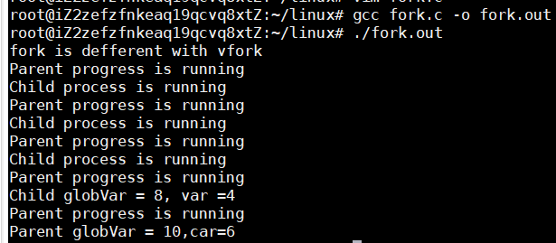
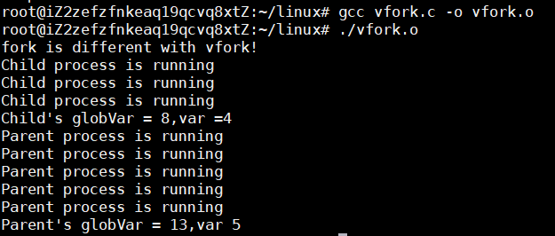
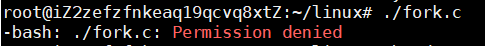
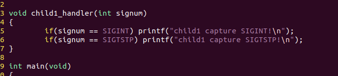
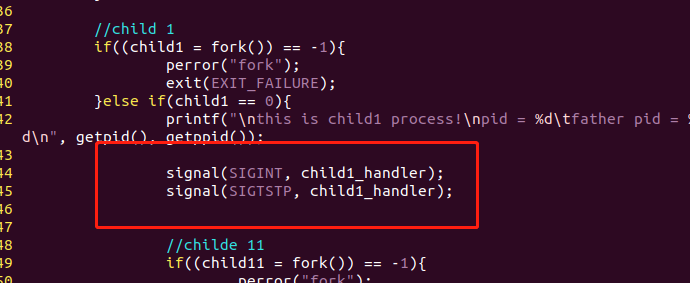
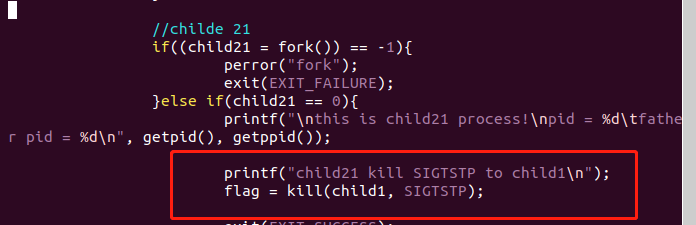
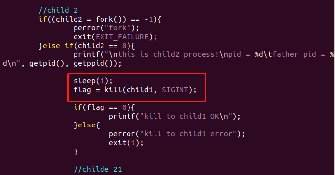
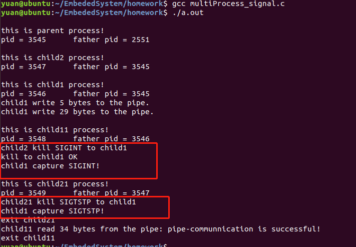
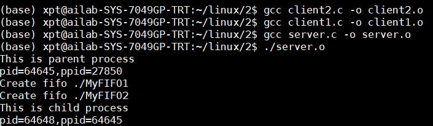
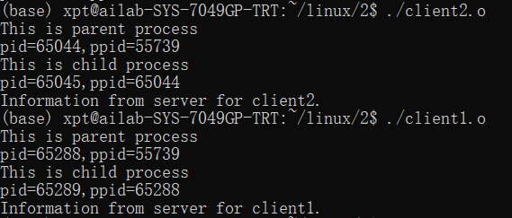

# 多进程编程

#### 第六组

#### 雷玉泉  刘晟荣  徐鹏涛


## 一、实验目的

1. 学会创建多进程程序，理解fork()，vfork() 创建 的子进程的特点。 
2. 学会使用有名管道和无名管道实现进程间通信。 
3. 学会使用信号机制实现进程间通信。 

## 二、实验内容

1. 编写fork()，vfork()多进程程序，通过输出结果 比较所创建的子进程的不同之处。

2. 编写fork()多进程程序，进程间模拟信号通信， 包括信号发送、捕捉与处理。

3. 编写fork()多进程程序，进程间实现有名管道和 无名管道通信。具体要求如下：

   a. 编写1个服务器程序server.c和2个客户端程序client1.c, client2.c ，服务器和客户端之间采用FIFO管道通信； 

   b. 服务器和客户端各自创建自己的子进程，父进程负责 完成FIFO管道通信，子进程负责输出接收到的信息， 父子进程间采用无名管道通信。 

## 三、实验过程与结果

### 1、编写fork()和vfork()函数

​         fork()函数的作用是创建一个新进程，由fork创建的进程称为子进程，fork函数调用一次返回两次，子进程返回值为0，父进程返回子进程的进程ID。 

​         fork函数设置如下：我们设定了一个全局变量globVar，同时还设置了一个局域变量var。

```c
#include <stdio.h>
#include <sys/types.h>
#include <unistd.h>
#include <stdlib.h>

int globVar = 5;

int main(void)
{
	pid_t pid;
	int var = 1;
	int i;
	printf("fork is defferent with vfork \n");

	pid = fork();
	if(!pid){
		i=3;
		while(i-- >0){
			printf("Child process is running\n");
			globVar++;
			var++;
			sleep(1);
		}
		printf("Child globVar = %d, var =%d\n",globVar,var);
	}
	else if(pid){
		i = 5;
		while( i-- >0){
			printf("Parent progress is running\n");
			globVar++;
			var++;
			sleep(1);
		}
		printf("Parent globVar = %d,car=%d\n",globVar,var);
		exit(0);
	}
	else{
		perror("Process creation failed\n");
		exit(-1);
	}
}

```

​        把该函数编译运行，得到结果如下：



​           vfrok()函数设置如下：

```c
#include<stdio.h>
#include<sys/types.h>
#include<unistd.h>
#include<stdlib.h>
int globVar = 5;
int main(void)
{
        pid_t pid;
	int var = 1;
	int i;
 
 	printf("fork is different with vfork!\n");
 
	pid = vfork();
	if(!pid){
		i=3;
	        while(i-- > 0)
 		{
 			printf("Child process is running\n");
			globVar++;
			var++;
	        	sleep(1);
	 	}
              printf("Child's globVar = %d,var =%d\n",globVar,var);
       }
        else if(pid){
                i = 5;
                while(i-- > 0)
                  {
                         printf("Parent process is running\n");
                         globVar++;
                         var++;
                         sleep(1);
                        }
                 printf("Parent's globVar = %d,var %d\n",globVar,var);
                exit(0);
                }
          else {
                perror("Process creation failed\n");
                 exit(0);
        }

 }

```

​     编译运行vfork()函数，结果如下：



在运行文件的过程中，遇到了下面的问题，查了下，是因为文件权限的问题，通过chmod指令得到解决。



最后，我们通过以上两个函数的执行可以看到一些区别：

​       fork()函数：

1. 使用 fork 创建子进程时，子进程继承了父进程的全局变量和局部变量。在子进程中，最后全局变量 globVar 和局部变量 var 的值均递增 3 ，分别为 8 和 4. 不管是全局变量还是局部变量，子进程与父进程对它们的修改互不影响。

2. 父进程中两者分别递增 5. 最后结果为 10 和 6

​     通过以上程序的运行结果可以证明 fork 的子进程有自己独立的地址空间。

3. 子进程和父进程的执行顺序是很随意的，没有固定的顺序。父子进程的输出是混杂在一起的。

   vfork()函数：

1. 用vfork()函数创建子进程后，父进程中globVar和var最后均递增了8.这是因为vfork的子进程共享父进程的地址空间，子进程修改变量对父进程是可见的。
2. 使用vfork(）函数子进程后打印的结果是子进程在前，父进程在后，说明vfork()保证子进程先执行，在子进程调用exit获exec之前父进程处于阻塞等待状态。

​     现在来总结下fork()和vfork()函数之间的区别：

 （1）fork（）：使用fork()创建一个子进程时，子进程只是完全复制父进程的资源。这样得到的子进程独立于父进程具有良好的并发性。
         vfork（）： 使用 vfor创建一个子进程时，操作系统并不将父进程的地址空间完全复制到子进程。而是子进程共享父进程的地址空间，即子进程完全运行在父进程的地址空间上。子进程对该地址空间中任何数据的修改同样为父进程所见。
（2）fork（）：父子进程执行顺序不定；
        vfork（）：保证子进程先运行，在调用exec或exit之前与父进程共享数据，在它调用exec或exit之后父进程才可能被调度运行。
（3）vfork保证子进程先运行，在它调用exec或exit后父进程才可能被调度运行。如果在调用这两个函数之前子进程依赖于父进程的进一步动作，则会导致死锁。

### 2、编写fork()多进程程序，进程间模拟信号通信，包括信号发送、捕捉与处理。

信号是在软件层次上对中断机制的一种模拟，在原理上，一个进程收到一个信号与处理器收到一个中断请求可以说是一样的。信号是异步的，一个进程不必通过任何操作来等待信号的到达，事实上，进程也不知道信号到底什么时候到达。
信号是进程间通信机制中唯一的异步通信机制，可以看作是异步通知，通知接收信号的进程有哪些事情发生了。

信号事件的发生有两个来源：硬件来源(比如我们按下了键盘或者其它硬件故障)；软件来源，最常用发送信号的系统函数是kill, raise, alarm和setitimer以及sigqueue函数，软件来源还包括一些非法运算等操作。

进程可以通过三种方式来响应一个信号：（1）忽略信号，即对信号不做任何处理，其中，有两个信号不能忽略：SIGKILL及SIGSTOP；（2）捕捉信号。定义信号处理函数，当信号发生时，执行相应的处理函数；（3）执行缺省操作，Linux对每种信号都规定了默认操作。显然，这里我们模拟（2）中的过程。

设子进程child1为接收信号的进程，捕捉其他进程发送给它的信号，并进行处理。

1.编写信号处理函数handler()。


2.在子进程child1中使用signal()函数，设置信号捕捉及信号处理函数。


3.在其他进程中，向child1发送信号。




4.程序运行结果。


从结果中可以看到，child1进程可以捕捉到其它进程发给它的信号，并对其进行处理。

### 3、编写fork()多进程程序，进程间实现有名管道和无名管道通信。

管道是 Linux 中进程间通信的一种常用方式，经常被用于命令行不同进程间通信，也可以在应用程序中建立进程间通信。

管道分为无名管道和有名管道两种。无名管道可用于具有亲缘关系进程间的通信，如父子进程、兄弟进程。有名管道克服了管道没有名字的限制，允许无亲缘关系进程间的通信。

管道是单向的字节流，它可以把一个进程的标准输出与另一个进程的标准输入连接起来，shell 负责建立进程间的这些临时性的管道，而进程根本不知道这些重定向操作，仍然按照通常的方式进行操作。 

a. 编写1个服务器程序server.c和2个客户端程序client1.c, client2.c ，服务器和客户端之间采用FIFO管道通信； 

b. 服务器和客户端各自创建自己的子进程，父进程负责完成FIFO管道通信，子进程负责输出接收到的信息，父子进程间采用无名管道通信。 

1.server.c

创建父子进程，在父进程中创立两个FIFO管道，对应两个client.
```
#include<unistd.h>
#include<stdio.h>
#include<stdlib.h>
#include <fcntl.h>
#include <limits.h>
#include <sys/types.h>
#include <sys/stat.h>
#include <string.h> 
#include <errno.h>
int main()
{
  pid_t pid;
  
  if ((pid=fork())==-1){
    perror("fork");
    exit(EXIT_FAILURE);
  }else if(pid==0){
    puts("This is child process");
    printf("pid=%d,ppid=%d\n",getpid(),getppid());
    exit(EXIT_SUCCESS);
  }else{
    puts("This is parent process");
    printf("pid=%d,ppid=%d\n",getpid(),getppid());
    int flag,fifo_fd; 
    const char *fifo_name = "./MyFIFO1";
    flag = mkfifo(fifo_name, 0777); 
    printf( "Create fifo %s\n", fifo_name);
    fifo_fd = open(fifo_name, O_RDONLY|O_NONBLOCK);
    //非阻塞方式，先以读方式打开，再以写方式打开，
    //否则报错：fifo open error:No such device or address
    fifo_fd = open(fifo_name, O_WRONLY|O_NONBLOCK); 
    if(fifo_fd ==-1)
      if(errno!=0)
        {printf("fifo open error:%s\n",strerror(errno));}
    char buffer[40]="Information from server for client1.";
    flag=write(fifo_fd, buffer, 40);
    if(flag == -1)
    {
      fprintf(stderr, "Write error on pipe\n");
      exit(EXIT_FAILURE);
    }
    const char *fifo_name1 = "./MyFIFO2";
    flag = mkfifo(fifo_name1, 0777); 
    printf( "Create fifo %s\n", fifo_name1);
    fifo_fd = open(fifo_name1, O_RDONLY|O_NONBLOCK);
    //非阻塞方式，先以读方式打开，再以写方式打开，
    //否则报错：fifo open error:No such device or address
    fifo_fd = open(fifo_name1, O_WRONLY|O_NONBLOCK); 
    if(fifo_fd ==-1)
      if(errno!=0)
        {printf("fifo open error:%s\n",strerror(errno));}
    char buffer1[40]="Information from server for client2.";
    flag=write(fifo_fd, buffer1, 40);
    if(flag == -1)
    {
      fprintf(stderr, "Write error on pipe\n");
      exit(EXIT_FAILURE);
    }
    while(1);
    exit(EXIT_SUCCESS);
  }
}
```

2.client1.c

创建client1的父子进程，父进程获得FIFO管道信息，通过无名管道传给子进程，子进程进行打印。

```
#include<unistd.h>
#include<stdio.h>
#include<stdlib.h>
#include <fcntl.h>
#include <limits.h>
#include <sys/types.h>
#include <sys/stat.h>
#include <sys/wait.h>
#include <string.h> 
#include <errno.h>
#include<memory.h>
int main()
{
  pid_t pid;
  int pfd[2];         
  if(pipe(pfd)<0)
  {      
    perror("pipe error");   
    exit(1);  
  }  
  if ((pid=fork())==-1){
    perror("fork");
    exit(EXIT_FAILURE);
  }else if(pid==0){
    puts("This is child process");
    printf("pid=%d,ppid=%d\n",getpid(),getppid());
    close(pfd[1]);   
    sleep(1);   
    char buff[40]; 
    read(pfd[0],buff,40);   
    printf("%s\n",buff);   
    close(pfd[0]);    
    exit(EXIT_SUCCESS);
  }else{
    puts("This is parent process");
    printf("pid=%d,ppid=%d\n",getpid(),getppid());
    const char *fifo_name = "./MyFIFO1";
    int flag,fifo_fd; 
    fifo_fd = open(fifo_name, O_RDONLY|O_NONBLOCK);
    if(fifo_fd ==-1)
      if(errno!=0)
        {printf("fifo open error:%s\n",strerror(errno));}
    char buffer[40];
    flag=read(fifo_fd, buffer, 40);
    if(flag ==-1)
      if(errno!=0)
        {printf("fifo read error:%s\n",strerror(errno));}
    close(pfd[0]);   
    write(pfd[1],buffer,40);   
    close(pfd[1]);
    waitpid(pid,NULL,0); 
    exit(EXIT_SUCCESS);
  }
}
```

3.client2.c

创建client2的父子进程，父进程获得FIFO管道信息，通过无名管道传给子进程，子进程进行打印。

```
#include<unistd.h>
#include<stdio.h>
#include<stdlib.h>
#include <fcntl.h>
#include <limits.h>
#include <sys/types.h>
#include <sys/stat.h>
#include <sys/wait.h>
#include <string.h> 
#include <errno.h>
#include<memory.h>
int main()
{
  pid_t pid;
  int pfd[2];         
  if(pipe(pfd)<0)
  {      
    perror("pipe error");   
    exit(1);  
  }  
  if ((pid=fork())==-1){
    perror("fork");
    exit(EXIT_FAILURE);
  }else if(pid==0){
    puts("This is child process");
    printf("pid=%d,ppid=%d\n",getpid(),getppid());
    close(pfd[1]);   
    sleep(1);   
    char buff[40]; 
    read(pfd[0],buff,40);   
    printf("%s\n",buff);   
    close(pfd[0]);    
    exit(EXIT_SUCCESS);
  }else{
    puts("This is parent process");
    printf("pid=%d,ppid=%d\n",getpid(),getppid());
    const char *fifo_name = "./MyFIFO2";
    int flag,fifo_fd; 
    fifo_fd = open(fifo_name, O_RDONLY|O_NONBLOCK);
    if(fifo_fd ==-1)
      if(errno!=0)
        {printf("fifo open error:%s\n",strerror(errno));}
    char buffer[40];
    flag=read(fifo_fd, buffer, 40);
    if(flag ==-1)
      if(errno!=0)
        {printf("fifo read error:%s\n",strerror(errno));}
    close(pfd[0]);   
    write(pfd[1],buffer,40);   
    close(pfd[1]);
    waitpid(pid,NULL,0); 
    exit(EXIT_SUCCESS);
  }
}
```

4.编译运行






## 四、实验总结

掌握了创建多进程程序的方法，充分理解fork()，vfork()创建的子进程的特点。

学会了使用有名管道和无名管道实现进程间通信的方法。 

使用信号机制实现了进程间通信。 

