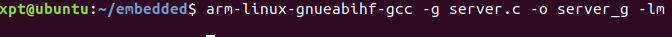

# 综合应用实验
#### 第六组
#### 徐鹏涛、雷玉泉、刘晟荣

## 一、实验目的
能够综合应用课程所学的技术与工具，包括：
1. Socket通信
2. 多进程、多线程编程
3. 交叉调试目标端程序
4. 磁盘分区与文件系统创建
5. 模块与驱动编程

## 二、实验内容
1. 将树莓派设为智能家居Linux服务器，可用来采集并维护环境数据，如PM2.5、温度、湿度、气味、电器状态数据等。在实际环境中数据来自相应的传感器，本次试验中用scull设备模拟。
2. 要求创建2个以上scull设备，设备驱动从内核源码树外(Kbuild)编译安装或加入到内核源码树内(需重新编译内核)。驱动要求包括：open、release、read、write、llseek、ioctl。
3. 实验中的环境数据存储在特定文件系统中。该文件系统要求具备属性：在线写入、持久性、断电可靠性。
4. PC机、移动设备或另外一个树莓派用作远程客户端，随时请求获取环境数据，客户端和服务器之间采用Socket通信。
5. APP编译采用交叉编译，用gdb-gdbserver交叉调试APP。

## 三、实验过程与结果
### 3.1 scull设备驱动
本实验编写scull设备驱动，共创建了三个设备文件，分别模拟PM2.5、温度、湿度传感器。

#### 3.1.1 程序介绍
程序主要包括驱动程序scull.c、编译文件Makefile以及测试程序test.c。

1、驱动程序scull.c  
驱动程序主要包括以下几个部分：  

（a）scull设备结构体定义，包括存储的数据量、描述字符设备的数据结构等信息，使用了file_operations结构，并为scull设备建立了字符设备结构体。  
（b）scull主次设备的编号。  
（c）驱动函数：open、release（内核用inode结构在内部表示文件）、read（读取设备数据至用户空间）、write（将用户空间的数据写入到设备中）、ioctl、llseek（修改文件的当前读写位置,并将新位置作为返回值返回）。  
（d）卸载模块，先删除设备，再删除class类，根据设备号注销设备。  
（e）初始化模块：首先获得内核识别的设备号，若动态分配则调用alloc_chrdev_region，若已知则调用register_chrdev_region；使用kmalloc动态的给scull_dev设备结构体在普通内核内存空间分配内存空间，并使用memset初始化为0；初始化每个设备的访问区块（即内存区块），（设定量子和量子集、互斥锁），调用scull_setup_cdev向内核注册这个char device。  

scull_setup_cdev注册char设备的流程：  
调用MKDEV由实参生成具体设备的设备号；  
初始化cdev，主要是指定其ops cdev_init(&dev->cdev, &scull_fops). dev->cdev在设备结构体中定义。  

2、编译文件Makefile  
在PC机上对驱动程序scull.c进行编译。

3、测试程序test.c  
在树莓派上对scull设备进行测试。  

#### 3.1.2 实验过程与结果（截图）  
（a）在主机端采用交叉编译；  


（b）将生成的scull.ko传至树莓派；  


（c）执行sudo insmod scull.ko 安装模块到树莓派中；  
  
遇到上面这样的问题，通过命令dmesg，发现问题是：  
  
应该是内核版本不一致的问题。解决方法：按照之前的实验替换了现有树莓派的内核，使内核版本一致。另外在解决这个问题时，看到内核配置文件.config不一样也会导致错误，这里重新交叉编译了一遍scull（要先删除之前的编译结果）。执行，没有报错。  
lsmod查看：  
  
ls /dev查看，并通过 ls -l /dev/scull_6* 查看创建3个设备节点的设备号：  


（d）测试scull驱动：  
test.c  


树莓派上gcc编译执行（执行时必须sudo）：  
  
可见scull设备驱动基本正确，open，read，write，lseek函数功能正常。  
最后可以通过 sudo rmmod scull 来卸载驱动，卸载后创建的设备也会自动删除。

### 3.2 环境数据存储在特定文件系统
具备属性：在线写入、持久性、断电可靠性。

（a）按照之前实验的方法建立Ext4格式分区  
查看当前的文件系统的使用情况：  
  
使用fdisk增加分区：  
sudo fdisk /dev/mmcblk0  
然后输入n增加分区：  
  
然后新建拓展分区：要建立一个新的逻辑分区，需要先建立一个扩展分区，输入e,建立拓展分区，选择默认值，扩展分区出来的是3MB：  
  
接下来根据需要创建逻辑分区：新建分区，输入 n add a new partition ；新建逻辑分区，输入l，建立逻辑分区：  
  
w保存退出，重启树莓派使分区生效。

（b）对分区格式化为需要的文件系统  
输入指令 sudo mkfs.ext4 /dev/mmcblk0p5：  


（c）将新增分区mount到某挂载点，并设置开机挂载  
输入指令 sudo mkdir /mnt/my_ext4  
设置开机挂载，修改/etc/fstab文件，新增一行：  
/dev/mmcblk0p5  /mnt/my_ext4 ext4    defaults    0    2

/dev/mmcblk0p5：新增的分区  
/mnt/my_ext4：挂载点  
ext4：文件系统  
defaults：文件系统参数  
0：第五项，dump，是否备份，0不备份，1每天，2不定期  
2：最后一项，fsck，0不检查，1检查，2检查（1的优先级高，比2先检查，一般是root设置为1）  
  
通过 mount -a 检查是否成功，成功不会显示。然后通过 df –h 查看挂载情况：
  
如果想删除分区，需要先卸载再删除。先用umount卸载参数为分区名称或者挂载点，再用 parted 磁盘名 rm [分区号] 来删除分区。

### 3.3 Socket通信

​        Socket通信用于树莓派（服务端）与PC或者另一块树莓派（客户端）进行通信。Socket通信是“open—write/read—close”模式的一种实现。在本次实验中，  PC客户端通过socket通信向服务端发送请求命令，请求获取环境数据。服务端会从上一步创建的特定文件系统中读取环境数据然后发送给客户端。

​      APP的思路是服务器端通过scull设备获取PM2.5、温度、湿度，保存到特定文件系统里；在客户端通过socket通信向服务器端发送请求；最后服务器端得到请求后从特定文件系统获取PM2.5、温度、湿度，通过socket传到客户端。

​    客户端代码见client_code(PC)的client.c：注释可以看到程序细节。大概就是socket发送请求，接收数据并打印。`

```
int main(void)
{
  int sockfd = 0;
  
  char recvBuff[6];  //传入的设备数据 3*2
  struct sockaddr_in serv_addr;


  

  if((sockfd = socket(AF_INET, SOCK_STREAM, 0))< 0)// 建立socket连接，为socket 数据结构分配存储空间 
    {
      printf("\n Error : Could not create socket \n");
      return 1;
    }
  //填写远程地址信息
  serv_addr.sin_family = AF_INET;
  serv_addr.sin_port = htons(5000);       //端口号
  serv_addr.sin_addr.s_addr = inet_addr("192.168.137.24");    //树莓派IP地址
  printf("requesting......\n");*

  if(connect(sockfd, (struct sockaddr *)&serv_addr, sizeof(serv_addr))<0)//连接
    {
      printf("\n Error : Connect Failed \n");
      return 1;
    }


  read(sockfd, recvBuff, sizeof(recvBuff));//读socket
 printf("The pm2.5 is: %c%c\n",recvBuff[0],recvBuff[1]);
  printf("The temperature is: %c%c\n",recvBuff[2],recvBuff[3]);
  printf("The humidity is: %c%c\n",recvBuff[4],recvBuff[5]);
  


  return 0;
}
```

`

​     服务端见server_code(raspberrypi)的sever.c: 服务器端通过scull设备获取PM2.5、温度、湿度，保存到特定文件系统里；最后服务器端得到请求后从特定文件系统获取PM2.5、温度、湿度，通过socket传到客户端。部分代码如下：

```
 while(1)
    {
        
      connfd = accept(listenfd, (struct sockaddr*)&client_addr,&addrlen);
       //从特定文件系统获取
    FILE *fpWrite0;
     if((fpWrite0=fopen("/mnt/my_ext4/pm2.5.txt","r"))== NULL)
      {
        perror("fail to read");
        exit (1) ;
      }
    fread(buf0,sizeof(buf0),2,fpWrite0);
    fclose(fpWrite0);
    FILE *fpWrite1;
     if((fpWrite1=fopen("/mnt/my_ext4/tem.txt","r"))== NULL)
      {
        perror("fail to read");
        exit (1) ;
      }
    fread(buf1,sizeof(buf1),2,fpWrite1);
    fclose(fpWrite1);
      FILE *fpWrite2;
     if((fpWrite2=fopen("/mnt/my_ext4/hum.txt","r"))== NULL)
      {
        perror("fail to read");
        exit (1) ;
      }
    fread(buf2,sizeof(buf2),2,fpWrite2);
    fclose(fpWrite2);
    //pm2.5
      sendBuff[0] = buf0[0];
      sendBuff[1] = buf0[1];
       //tem
      sendBuff[2] = buf1[0];
      sendBuff[3] = buf1[1];
       //hum
      sendBuff[4] = buf2[0];
      sendBuff[5] = buf2[1];
      printf("server message: %s\n",sendBuff);
      //socket send
      write(connfd, sendBuff, strlen(sendBuff));

      close(connfd);
      sleep(1);

      }
```

​    

1、在socket通信中主要分为socket()函数、bind()函数、listen()、connect()函数、accept()函数、read()、write()函数、close()函数等。
（1）socket()函数：int socket(int domain, int type, int protocol)；
socket函数对应于普通文件的打开操作。普通文件的打开操作返回一个文件描述字，而socket()用于创建一个socket描述符（socket descriptor），它唯一标识一个socket。这个socket描述字跟文件描述字一样，后续的操作都有用到它，把它作为参数，通过它来进行一些读写操作。

（2）bind() 函数：int bind(int sockfd, const struct sockaddr *addr, socklen_t addrlen)；bind()函数把一个地址族中的特定地址赋给socket。例如对应AF_INET、AF_INET6就是把一个ipv4或ipv6地址和端口号组合赋给socket。

（3）listen()、connect()函数：int listen(int sockfd, int backlog)；int connect(int sockfd, const struct sockaddr *addr, socklen_t addrlen)；作为一个服务器，在调用socket()、bind()之后就会调用listen()来监听这个socket，如果客户端这时调用connect()发出连接请求，服务器端就会接收到这个请求。

（4）accept()函数：int accept(int sockfd, struct sockaddr *addr, socklen_t *addrlen)；TCP服务器端依次调用socket()、bind()、listen()之后，就会监听指定的socket地址了。TCP客户端依次调用socket()、connect()之后就想TCP服务器发送了一个连接请求。TCP服务器监听到这个请求之后，就会调用accept()函数取接收请求，连接建立成功。之后就可以开始网络I/O操作了，即类同于普通文件的读写I/O操作。

（5）	read()、write()等函数：网络I/O操作有下面几组：read()/write()、recv()/send()、readv()/writev()、recvmsg()/sendmsg()、recvfrom()/sendto()
（6）	close()函数：在服务器与客户端建立连接之后，会进行一些读写操作，完成了读写操作就要关闭相应的socket描述字。

2、在pc端交叉编译server.c:（编译的文件在树莓派上运行发现不可以，pc端重新安装了一次交叉编译工具重新编译，问题解决）


将编译好的server文件传入树莓派上。

在pc端编译client.c:


在树莓派上执行服务端程序：


可以看到服务器端三个环境值，然后等待客户端请求命令。

在pc端执行客户端程序：


发现获取了正确的环境信息。这时，树莓派端运行如下，表示传输了一次信息。


综上，socket通信构建成功。

### 3.4  gdb-gdbserver交叉调试  

首先在Host端生成带有调试信息的server_g文件：



将其传至树莓派。然后在树莓派端执行./gdbserver :1234 server_g

(权限问题需要执行)chmod 777 server_g


在host端执行arm-linux-gnueabihf-gdb sever_g(进入 gdb 后，进行远程调试。(gdb)target remote 192.168.137.24:1234 其中192.168.137.24是树莓派 ip，1234 是树莓派开的端口):

下面是具体调试过程的一部分（设置断点、继续执行）：

Host端：


树莓派端：

